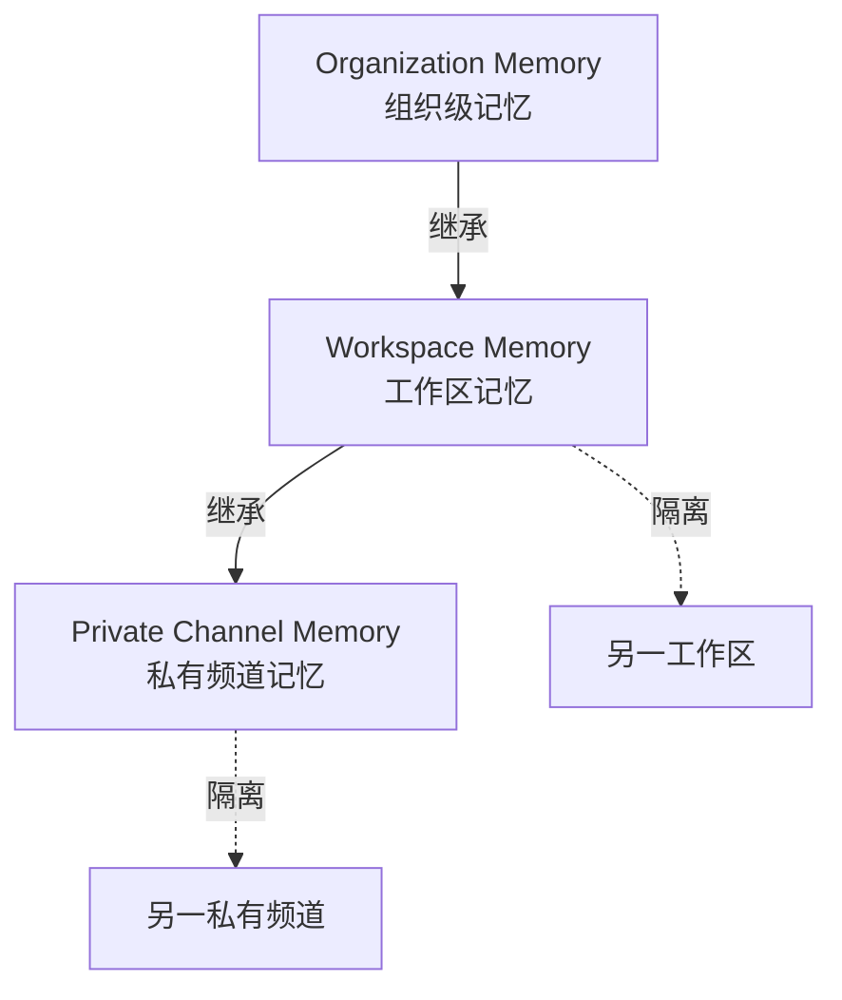

# Claude Tag 数据、记忆与审计

> 汇总 [[What is Claude Tag]] 中关于**数据存储、可见性、保留期、记忆作用域、审计**的所有规则。

这些规则直接体现了 [[Agent Identity 访问模型]] "**记忆与权限尊重频道边界**"的设计原则。

---

## 数据可见性：平台间隔离

> **核心原则**：**Slack 中的对话与 Claude 主对话历史**互不可见**。

| 对话发起来源 | 在 Slack 中可见？ | 在 Claude 网页历史中可见？ |
|------------|------------------|------------------------|
| **Slack 中发起** | ✅ | ❌ |
| **Claude 网页/App 发起** | ❌ | ✅ |

> **目的**：让工作在不同平台之间**自然分隔**，避免混用。

---

## 数据存储与保留期

| 数据类型 | 保留规则 |
|---------|---------|
| Slack 中 Claude 对话 | **断开集成或卸载应用后 30 天**自动从 Claude 删除 |
| Slack 中的对话副本 | **遵循组织自身的 Slack 保留策略** |
| Claude Tag 记忆（channel/workspace memory） | **长期保留**而非每次任务后丢弃 |

---

## 记忆的作用域

> **关键设计**：Claude Tag 的记忆按**频道和工作区**作用域存储，**不跨边界共享**。

### 记忆分层



### 谁能看到/编辑/删除

- ✅ **管理员**：可查看、编辑、删除记忆
- ❌ **普通成员**：默认不能直接编辑

### 归属

| Surface | 归属 |
|---------|------|
| 频道工作 | **组织身份**（Claude App / Claude GitHub App） |
| DM 工作 | **个人账户** |

---

## 审计视图（Audit View）

在 **Organization settings → Claude Tag → Audit** 中可查看：

| 审计项 | 内容 |
|--------|------|
| 调度的任务 | **所有计划任务和一次性任务** |
| Agent Identity 网络调用 | 所有使用组织身份的网络请求 |
| Slack 帖子 | 自动归属 **Claude App** 名下 |
| GitHub 提交/PR | 作者为 **Claude GitHub App**，**链接回 Slack 线程** |

> **核心优势**：每个动作**既在 Claude Tag 审计中出现，也在产生它的外部系统日志中出现**——形成**双重审计**。

---

## 频道内的"自检"能力

> 在任何频道，你可以直接 @Claude 询问：
> 
> **"@Claude what triggers do you have set up here?"**

会返回该频道中所有已设置的"standing work"（持续性任务），并允许**直接关闭**。

---

## 数据删除的两种路径

### 路径 1：断开集成

```
管理员卸载应用 / 断开集成
        ↓
30 天内自动删除 Claude 中的对话
        ↓
Slack 中的副本遵循 Slack 自身保留策略
```

### 路径 2：管理员主动删除记忆

- 在管理界面定位到具体频道/工作区
- 删除特定记忆条目
- 立即生效

---

## 安全模型回顾

| 维度 | Claude Tag 实现 |
|------|---------------|
| **身份隔离** | 每个私有频道独立身份 → 详见 [[Agent Identity 访问模型]] |
| **凭证存储** | 独立存储、请求时注入网络边界 |
| **出站过滤** | 任何管理员未允许的主机**直接阻断** |
| **记忆边界** | 私有频道学到的内容**不会泄露**到工作区 |
| **审计追溯** | 双重审计（Claude Tag + 外部系统） |
| **职责分离** | 频道工作用组织身份，DM 用个人身份 |

---

## 与 Multiplayer Agents 三大能力的对应

| Multiplayer 能力 | Claude Tag 数据/记忆实现 |
|----------------|------------------------|
| **持久记忆** | 频道/工作区级长期记忆（而非会话级） |
| **独立凭证** | [[Agent Identity 访问模型]] |
| **持续广泛访问** | 三层访问模型（Org → Workspace → Private Channel） |

---

## 来源

- **官方支持文档**: [[What is Claude Tag]]
- **相关**: [[Agent Identity 访问模型]]、[[Claude Tag 设置与管理]]、[[Multiplayer Agents 概念]]
- **官方链接**: <https://support.claude.com/en/articles/15594475-what-is-claude-tag>