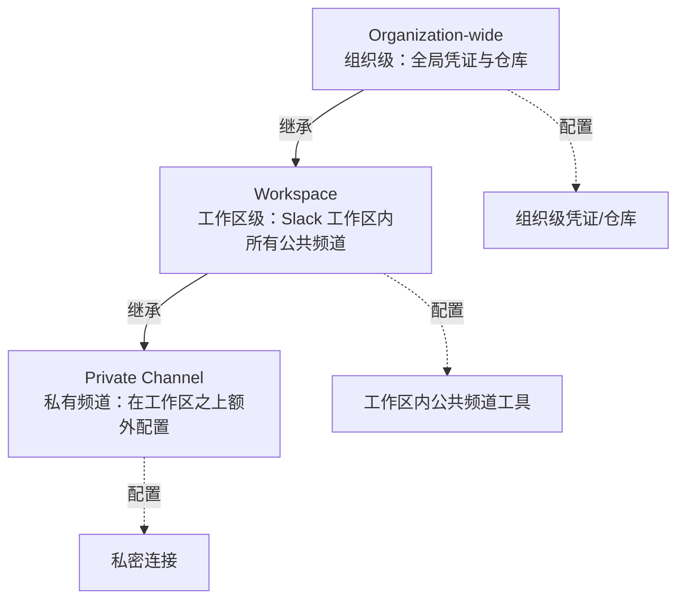

# Claude Tag 设置与管理（管理员指南）

> **目标读者**：组织中的 **Primary Owner 或 Owner**（只有这两个角色能配置 Claude Tag；**Admin 角色不够**）。

本文汇总 [[What is Claude Tag]] 官方支持文档中关于**安装、访问控制、预算、权限层级**的具体操作规范。

---

## 上线时间表

> [!warning] 重要时间节点
> **2026-08-03**：原 "Claude in Slack" 将**自动切换**到新版 Claude Tag 体验。
> 
> **从该日起**，要在 Slack 中集成 Claude，请使用 **Claude Tag**。

迁移窗口：**30 天**——管理员可在此期间主动 opt-in 切换。

---

## 三种使用面（Surfaces）

Claude Tag 通过三种方式集成到 Slack：

| Surface | 触发方式 | 计费 | 执行身份 |
|---------|---------|------|---------|
| **频道标签** | 在频道中 @Claude | **组织** | **组织身份** |
| **直接消息** | 给 @Claude 发 DM | **个人** claude.ai | 用户个人 |
| **AI 助手面板** | 点击 Slack 顶栏 Claude 图标 | **个人** claude.ai | 用户个人 |

> **关键差异**：频道标签下 Claude **作为组织身份**使用管理员为该频道配置的工具；DM 和面板下 Claude 使用**用户账户已启用的能力**（如网页搜索、已连接工具）。

---

## 四步启动流程

1. **Pair** Claude Tag 与 Slack 工作区
2. 给 Claude 访问工具的权限（见下文"三层访问层级"）
3. **设置组织月度预算上限**
4. 在**私有频道测试**确认可正常工作

---

## 访问控制：三种成员访问模式

在 **Organization settings → Claude in Slack** 中，**Member Access** 有三种模式：

| 模式 | 允许调用 Claude 的范围 |
|------|---------------------|
| **Slack 工作区全员开放** | 工作区中所有人 |
| **Claude 组织成员开放** | Claude 组织中所有成员 |
| **仅指定角色**（仅 Enterprise 可用） | 仅被授予"Claude in Slack"能力的自定义角色成员 |

> **作用范围**：该设置**同时影响**频道标签和 DM。
> 
> 详见：<https://claude.com/docs/claude-tag/admins/restrict-access>

---

## 预算管理（Spend Limits）

Claude Tag **按使用量计费**——**与人头数无关**。所有预算控制在管理员控制台的 **usage 设置**中。

### 四种预算控制

| 类型 | 说明 |
|------|------|
| **Organization-wide limit** | 组织总支出**硬上限**，**不可突破** |
| **Per-channel limits** | 单频道上限（在组织上限之上） |
| **Threshold alerts** | 达到 **75%** 和 **95%** 时通知管理员 |
| **Usage analytics** | **按频道**的花销明细 |

### 计费差异

| Surface | 计费对象 |
|---------|---------|
| 频道中 @Claude | **组织**账户 |
| DM 中 @Claude | **个人** claude.ai 账户 |

> [!important] 拒绝而非截断
> **超出上限的任务会被直接拒绝，不会"悄悄中断"。**
> 
> 被阻止的用户可**直接在 Slack 中**向管理员申请更多额度——阻断消息会**明确告知**是预算触发还是余额不足。

详见：<https://claude.com/docs/claude-tag/admins/restrict-access#set-spend-limits>

---

## 访问与权限的三层模型

> Claude Tag 的访问配置在**三个层级**进行。**每一层继承上一层的权限和记忆**。

### 各层职责

#### 🏛️ Organization-wide（组织级）

- **适用**：Claude Tag 安装的所有地方
- **典型配置**：组织通用的 GitHub 凭证、基础 SaaS 工具 API key

#### 🏢 Workspace（工作区级）

- **适用**：Slack 工作区内所有**公共频道**
- **继承**：组织级权限 + 记忆
- **典型配置**：与本工作区相关的特定仓库、工具

#### 🔒 Private Channel（私有频道）

- **适用**：单个私有频道
- **额外配置**：可**叠加**比工作区**更多**的凭证或仓库
- **典型用途**：把敏感连接限制在小范围

> **典型场景示例**：
> - 法务工作频道 → 法律工具、案例库的凭证**隔离**
> - 工程工作频道 → 代码仓库、生产数据库的凭证**隔离**
> - 两者**互不干扰**，记忆也隔离

详见：<https://claude.com/docs/claude-tag/concepts/agent-identity>

---

## RBAC（基于角色的访问控制）

在 **Enterprise** 计划中可启用：

- 在三层访问模型之上**叠加用户角色检查**
- 例：仅"高级工程师"角色能在 #production-deploy 频道 @Claude 执行部署
- 与 [[Agent Identity 访问模型]] 中提到的"identity-aware overlay"是同一方向

---

## 管理员操作清单

- [ ] 在 Organization settings 完成 **Member Access** 配置
- [ ] 设置 **organization-wide spend limit**
- [ ] 为关键频道设置 **per-channel limit**
- [ ] 在 **Audit** 视图检查智能体活动
- [ ] 至少在一个**私有频道测试**后再正式推广
- [ ] （Enterprise）配置 RBAC 自定义角色

---

## 来源

- **官方支持文档**: [[What is Claude Tag]]
- **官方发布博客**: [[Introducing Claude Tag]]
- **相关概念**: [[Agent Identity 访问模型]]
- **官方链接**: <https://support.claude.com/en/articles/15594475-what-is-claude-tag>