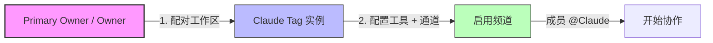

# Claude Tag

## 是什么

**Claude Tag** 是 Anthropic 推出的**多人协作智能体产品**，让人类和 Claude 在**同一个工作空间**（如 Slack）中协作，面向**团队共享目标**。

> 工作形态从"**单人 + 单一聊天窗口**"演化为"**团队 + 多人协作智能体**"。

---

## 发布与可用性

| 维度 | 详情 |
|------|------|
| **首发平台** | Slack |
| **可用计划** | **Claude Enterprise / Team**（beta） |
| **驱动模型** | **Claude Opus 4.8** |
| **替换产品** | 原 "Claude in Slack" 应用 |
| **强制切换日** | **2026-08-03** |
| **迁移窗口** | 30 天 |

> **官方标语**：**"Tag @Claude into a conversation and it takes on real work, using your organization's tools and the shared context around it."**

---

## 四种核心优势

> 与之前的 Claude Code / Cowork 相比，tagging Claude 带来四个新优势：

### 1️⃣ 多人协作（Multiplayer）

- 一个 Slack 频道中**只有一个 Claude**，但与**所有人**交互
- 任何人都能看到它**正在做什么**
- 可以**接续**别人留下的对话

> 这与"单人对话"或"单次任务"完全不同——**更像与队友协作**。

### 2️⃣ 持续学习（Learns over time）

- Claude 跟随频道的过程中**积累上下文**
- 用户无需**反复从头解释**
- 在**获得授权**的情况下，可从**其他 Slack 频道和数据源**自动学习
  > ⚠️ **不会从私有频道**获取信息

### 3️⃣ 主动汇报（Takes initiative）

当启用 **ambient behavior** 时：

- Claude **主动**推送它认为你**需要知道**的信息
- 从其所在频道和连接的工具中**标记相关信息**
- **跟进**沉寂未解决的线索或任务

### 4️⃣ 异步工作（Works asynchronously）

- 设置任务后，你可以**专注于其他优先级**
- Claude 可**为自己调度任务**，**数小时到数天**自主推进项目
- Anthropic 内部体验：**大量时间用于把任务并行委托给多个 Claude**

> **DM 补充**：直接消息给 Claude 时，它会**使用你个人账户已启用的能力和工具**（web search、个人连接器等）**私密地**响应。

---

## 启动方式（两步）

> **只有 Primary Owner / Owner 能配置**——**Admin 角色不够**。

详见 [[Claude Tag 设置与管理]]

---

## 核心定位

- **非个人助手**：而是拥有**独立凭证**的**团队成员**
- **工作在协作工具内**：直接在 Slack 频道参与讨论、接收任务、交付结果
- **公开上下文**：通过读取团队公开内容建立理解

---

## 两种使用场景对比

### 1️⃣ 团队协作（公开）

在 Slack 频道中 @Claude Tag：

- 参与公开讨论
- 接收公开分配的任务
- 工作内容对全团队可见
- 适用：项目执行、代码协作、研究综合、数据分析

### 2️⃣ 个人私聊（私密）

发送 @Claude Tag 直接消息：

- 个人信息保持私密
- 可使用个人 MCP 连接器
- 适用：敏感内容、个人任务

| 维度 | 频道中 @Claude | DM 中 @Claude |
|------|--------------|--------------|
| 执行身份 | **组织身份** | **个人账户** |
| 使用的工具 | **管理员为该频道配置** | 用户个人已启用能力 |
| 计费 | **组织** | **个人** |
| 历史归属 | **组织审计日志** | **个人 claude.ai 历史** |

---

## 内部影响（Anthropic 数据）

> [!quote] 来自 Introducing Claude Tag
> "Tagging **@Claude** is now one of the main ways we get things done at Anthropic. Today, **65% of our product team's code is created by our internal version of Claude Tag**."

- **产品团队代码**：65% 由 Claude Tag 生成
- 模式**已超出工程**范围：
  - 追踪产品指标和数据
  - 处理支持工单
  - 协助定位复杂 bug 根因

---

## 接入四步流程

1. **Pair** Claude Tag 与 Slack 工作区
2. 给 Claude 访问工具的权限
3. 设置组织**月度预算上限**
4. 在**私有频道测试**确认可正常工作

详见 [[Claude Tag 设置与管理]]

---

## 安全与权限

Claude Tag 基于 **[[Agent Identity 访问模型]]**：

- 不借用人类账号
- 拥有自己的 Slack / GitHub / 数据仓库账号
- 三层访问模型：组织 → 工作区 → 私有频道
- 完整审计：Claude Tag 审计 + 外部系统自身日志

详见 [[Claude Tag 数据与记忆]]

---

## 相关产品

- **Agent Teams (Claude Code)**：代码协作场景下的多人智能体 → <https://code.claude.com/docs/en/agent-teams>
- **Claude.ai**：纯个人场景
- **Claude Cowork**：个人桌面协作

---

## 链接

- **产品发布博客**: [[Introducing Claude Tag]]
- **官方支持文档**: [[What is Claude Tag]]
- **访问模型**: [[Agent Identity 访问模型]]
- **官方产品页**: <https://www.claude.com/product/tag>
- **官方文档**: <https://www.claude.com/docs/claude-tag/overview>

---

## 来源

- [[Introducing Claude Tag]]
- [[What is Claude Tag]]
- [[Building Effective Human-Agent Teams - Claude Blog]]