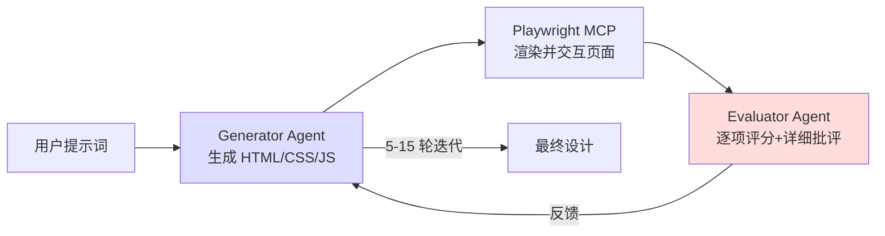
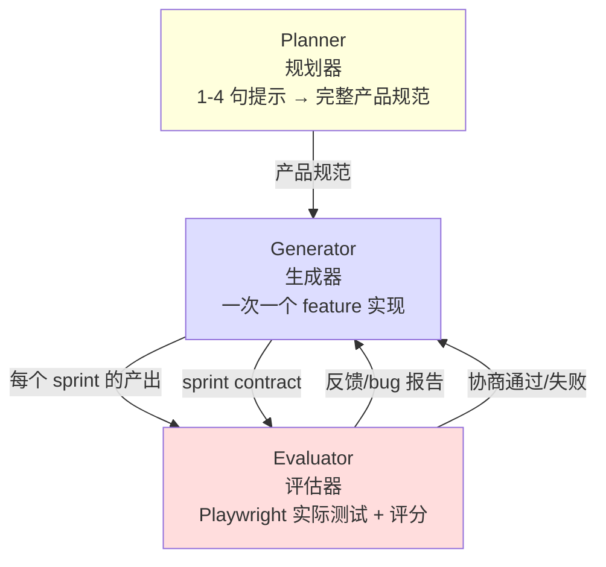

# Harness 设计：长时应用开发

> **来源**：Anthropic Labs 的 Prithvi Rajasekaran 撰写的工程博客，记录了为长时（multi-hour）自主编码任务设计**多智能体 Harness** 的迭代历程。

本文是 [[Doer-Verifier 框架]] 思想的**工程实现深化**——从"双智能体"扩展到"**生成器 + 评估器 +（可选）规划器**"的三智能体 GAN 启发架构。

---

## 问题的提出

Anthropic 之前已通过 prompt 工程和 Harness 设计显著提升 Claude 的长时编码表现，但仍遇到两个**根本性天花板**：

1. **主观质量难以评估**——前端设计"好不好"无标准答案
2. **自我评估偏差**——智能体倾向于**赞美自己的工作**

> **关键洞见**：受 **GAN（生成对抗网络）** 启发，将"做"和"评"**结构性地分离**。

---

## 为什么"朴素实现"不够

### 长时任务的两个根本失效模式

#### 1. 上下文连贯性丧失

随着上下文窗口填满，模型会**逐渐失去连贯性**。部分模型还会出现 **"context anxiety"**：

> 接近它**认为的**上下文上限时**提前收工**。

**三种缓解策略对比**：

| 策略 | 做法 | 优劣 |
|------|------|------|
| **Compaction（压缩）** | 保留同一智能体，原位摘要早期对话 | 保留连续性，但**不提供干净的起点**——context anxiety 仍存在 |
| **Context Reset（重置）** | 清除上下文，启动**新智能体**，通过**结构化交接**传递状态 | 干净起点，但**增加**编排复杂度、token 开销、延迟 |
| **不重置（Opus 4.6）** | 依赖模型自身能力 + Agent SDK 自动压缩 | 当模型足够强时**最简洁** |

> **实测**：Claude Sonnet 4.5 的 context anxiety **强到 compaction 不够**，**必须重置**。
> Claude Opus 4.6 大幅缓解，**Harness 中可彻底去掉重置**。

#### 2. 自我评估偏差（Self-evaluation）

> **核心问题**：让智能体评估自己产出时，它倾向于**自信地赞美**——即使质量明显平庸。

- **主观任务**（如设计）尤为严重——没有"测试通过/失败"的二元判断
- **即使客观任务**，智能体也常**判断失误**妨碍表现

> **核心解法**：**把"做事"和"判断"分给不同的智能体**。

仅仅分离**不立即消除**宽容——评估器仍是倾向于慷慨的 LLM。但**调整一个独立评估器变得严格**，远比**让生成器自我批评**更容易。一旦外部反馈存在，生成器就有了**具体可迭代的依据**。

---

## 前端设计实验：让主观质量变得可评分

> **起点**：前端设计是 self-evaluation 问题**最明显**的领域——没有干预时，Claude 默认产出"安全、可预测但视觉平庸"的布局。

### 两个洞见

1. **美学虽无法完全量化**，但可以通过**编码设计原则和偏好**的评分标准来改善。
   - "这个设计美吗？" 难以一致回答
   - "它遵循了我们的设计原则吗？" → 给了 Claude **具体可评分的依据**

2. **把生成与评分分离** → 创造反馈循环推动生成器向更强输出演化。

### 四项评分标准（同时给生成器和评估器）

| 标准 | 关注点 | 默认表现 | 加权 |
|------|--------|---------|------|
| **Design quality**（设计质量） | 是否是**有机整体**而非元素堆砌——色彩、字体、布局、图像**共同营造**独特氛围和身份 | 较弱 | **高** |
| **Originality**（原创性） | 是否有**自定义决策**的痕迹（vs 模板化、库默认、AI 生成模式） | 较弱 | **高** |
| **Craft**（工艺） | 技术执行——字体层级、间距一致性、色彩和谐、对比度 | 已较好 | 中 |
| **Functionality**（功能性） | **美学之外**的可用性——能否理解界面做什么、找到主操作、完成任务 | 已较好 | 中 |

> **明确惩罚**："紫色渐变覆盖白色卡片"等典型 **AI slop** 模式。
> **加权偏向** Design quality 与 Originality → 推动模型**冒更大美学风险**。

### 评估器校准

使用 **few-shot 示例 + 详细分数拆解**校准评估器——确保评估者的判断**与人类偏好对齐**，减少迭代间的分数漂移。

### 循环架构

基于 **Claude Agent SDK** 构建：



- **评估器实际导航页面**、截图、仔细研究实现后再产出评估
- 每次迭代评估器推动生成器朝**更独特方向**演化
- **战略决策**：分数趋势良好 → **继续精炼当前方向**；否则 → **完全切换美学路线**
- **完整运行最长 4 小时**

### 关键观察

- 评估器分数随迭代**改善后趋于平台期**
- 部分生成是**渐进式精炼**，部分是迭代间**突然的美学转向**
- 即使**第一轮**产出也明显**优于无提示基线**——评分标准和关联语言**本身就引导模型远离默认套路**
- 评分标准的措辞会以**未完全预期的方式**引导生成器
  > 例：包含"最好的设计是博物馆级别"会推动设计向**特定视觉收敛**

### 案例：荷兰艺术博物馆网站

> 第 10 轮迭代中，模型**完全抛弃**了之前的暗色简洁风格，**重新构想**为**空间体验**：
> 
> - CSS 透视渲染的**棋盘地面 3D 房间**
> - 自由挂置的画作
> - 门洞导航替代滚动/点击
> 
> 这是**单次生成中从未见过的**创造性飞跃。

---

## 扩展到全栈开发

> 带着前端实验的洞见，将 **GAN 启发的模式**应用到全栈开发。
> 
> 生成器-评估器循环**自然对应**软件开发生命周期——代码审查与 QA 扮演与设计评估器**相同的结构性角色**。

### 三智能体架构



### 各 Agent 职责

#### 🎯 Planner（规划器）

- 把**简单的 1-4 句提示**扩展为**完整产品规范**
- **强调范围雄心**，关注**产品上下文**与**高层技术设计**而非细节
  > **为何避免过早具体**：若规划器过早指定细节并出错，错误会**级联**到下游实现
- 让 agent **自己摸索实现路径**，约束**交付物**
- 主动**发掘把 AI 特性编织到产品中的机会**

#### ⚙️ Generator（生成器）

- **一次一个 feature**（sprint 模式）实现
- 技术栈：**React + Vite + FastAPI + SQLite**（后期换 PostgreSQL）
- 每个 sprint **自评**后再交给 QA
- **git 版本控制**

#### ✅ Evaluator（评估器）

- 用 **Playwright MCP** 像用户一样**点击操作**应用
- 测试 **UI 功能、API 端点、数据库状态**
- 按**前瞻性的标准**评分（产品深度、功能、视觉设计、代码质量）
- 每项标准有**硬阈值**——任意一项未达标 → sprint 失败
- **生成详细反馈**给生成器

### 关键机制：Sprint Contract（冲刺合同）

> **每个 sprint 开始前**，生成器和评估器**协商合同**——先就"什么算完成"达成一致，**再写任何代码**。

```
存在原因：产品规范有意保持高层 → 需要一个"用户故事 ↔ 可测试实现"桥梁

1. 生成器提议：本 sprint 我将构建什么、如何验证成功
2. 评估器审查：确保生成器在构建正确的东西
3. 双方迭代直到达成一致
4. 生成器按合同构建
5. 完成后交 QA
```

**通信通过文件完成**：一个 agent 写文件，另一个读并回复（在同一文件或新文件）。这让工作**忠实于规范**而**不过早过度具体化**实现。

---

## Harness 运行对比

**测试提示词**：「Create a 2D retro game maker with features including a level editor, sprite editor, entity behaviors, and a playable test mode.」

| Harness | 时长 | 成本 |
|--------|------|------|
| **Solo**（单 agent） | 20 min | **$9** |
| **Full Harness**（三智能体） | 6 hr | **$200** |

> **成本 20 倍以上**，但**输出质量差异立刻显现**。

### Solo 模式的问题

- 布局**浪费空间**，固定高度面板让视口大部分空白
- 工作流**生硬**——没有 UI 引导先建 sprite/entity 再填关卡
- **游戏坏了**——entity 出现在屏幕但**不响应输入**
- 代码层面：entity 定义与游戏 runtime 的连线**已断**，**UI 无任何提示**

### Full Harness 的优势

- 规划器把一句话扩展为 **16 个 feature / 10 个 sprint** 的规范
- **远超** Solo 范围：sprite 动画系统、行为模板、音效音乐、AI 辅助 sprite 生成与关卡设计、可分享链接的游戏导出
- 规划器调用了 **frontend-design skill** → 创建**视觉设计语言**作为规范的一部分
- 立即显示**更精致流畅**
- canvas **使用全视口**，面板**尺寸合理**，界面**有视觉一致性**
- **内置 Claude 集成**——通过提示词生成游戏各部分
- **最大差异在 Play Mode**：entity **能移动**，能玩游戏（Solo 完全做不到）

### 评估器的实际表现示例

| 合同条件 | 评估器发现 |
|---------|----------|
| 矩形填充工具应支持 click-drag 填充区域 | **FAIL** — 工具只在拖拽开始/结束点放置 tile，未填充区域。`fillRectangle` 函数存在但 mouseUp 未正确触发 |
| 用户可选中并删除已放置的 entity spawn points | **FAIL** — `LevelEditor.tsx:892` 的 Delete 键处理要求 `selection` 和 `selectedEntityId` 都设置，但点击 entity 只设置 `selectedEntityId`。条件应为 `selection \|\| (selectedEntityId && activeLayer === 'entity')` |
| 用户可通过 API 重新排序动画帧 | **FAIL** — `PUT /frames/reorder` 路由定义在 `/{frame_id}` 路由之后。FastAPI 把 "reorder" 匹配为 frame_id 整数并返回 422: "unable to parse string as an integer" |

> **评估器调到这种水平需要工作**。**开箱即用**的 Claude 是**糟糕的 QA agent**——
> - 早期会**识别合法问题**但说服自己**不是大问题**而放行
> - 倾向于**表面测试**而非探查边界，遗漏细微 bug
> 
> **调优循环**：读评估器日志 → 找到判断**与人类偏好背离**的例子 → **更新 QA 提示词**针对那些问题。

---

## Harness 简化迭代

> 第一版 Harness **结果令人鼓舞**，但**庞大、缓慢、昂贵**。
> 
> 下一步：在**不降低表现**的前提下简化。

### 核心原则

> **Harness 中的每个组件都编码了"模型做不了什么"的假设——这些假设值得压力测试，因为它们可能错误，也会随模型进步而过时。**

> 来自 [[智能体官方定义|Building Effective Agents]] 的根本原则：**"找到最简单的方案，只在需要时增加复杂度"**。

### 方法论：逐一移除组件

- **激进简化尝试**失败——**无法复制**原始表现，且难以判断**哪些组件是 load-bearing**
- 转为**更系统化**：**一次移除一个组件**，审视其对最终结果的影响

### 移除 Sprint 结构

> Opus 4.6 的发布提供了**进一步简化 Harness 的动机**——
> "更细致地规划、更长时间持续执行 agentic 任务、在更大代码库中更可靠运行、更好的代码审查与调试能力"。

#### 实验结果

| 组件 | 移除/保留 | 原因 |
|------|---------|------|
| **Sprint 分解** | 移除 | Opus 4.6 自身能处理连贯工作 |
| **Planner** | **保留** | 没有它，生成器会**范围过窄** |
| **Evaluator** | 保留为**单次终末评估**（非每 sprint） | 见下 |

#### Evaluator 的"非二元"价值

> Evaluator **不是固定的是/否决策**——当任务**超出当前模型可靠 solo 完成的范围**时，它**就值得成本**。

| 模型 | 评估器作用 |
|------|---------|
| **Opus 4.5** | 接近"边界"——评估器捕获**整个构建中有意义的问题** |
| **Opus 4.6** | 模型能力提升 → 边界外移；评估器在**仍处于边界外的任务**上提供 lift，在**边界内**成为不必要开销 |

---

## 简化版 Harness 的运行结果

**测试提示词**：「Build a fully featured DAW in the browser using the Web Audio API.」

| 阶段 | 时长 | 成本 |
|------|------|------|
| Planner | 4.7 min | $0.46 |
| Build (Round 1) | 2 hr 7 min | $71.08 |
| QA (Round 1) | 8.8 min | $3.24 |
| Build (Round 2) | 1 hr 2 min | $36.89 |
| QA (Round 2) | 6.8 min | $3.09 |
| Build (Round 3) | 10.9 min | $5.88 |
| QA (Round 3) | 9.6 min | $4.06 |
| **总计 V2 Harness** | **3 hr 50 min** | **$124.70** |

> 仍**长且贵**，但已**远好于 V1**。**大部分时间花在 Builder**——连续 **超过 2 小时**无 sprint 分解也能连贯运行。

### QA 仍捕获了真实差距

> **Round 1 反馈**：
> "This is a strong app with excellent design fidelity, solid AI agent, and good backend. The main failure point is **Feature Completeness** — while the app looks impressive and the AI integration works well, several core DAW features are display-only without interactive depth: clips can't be dragged/moved on the timeline, there are no instrument UI panels (synth knobs, drum pads), and no visual effect editors (EQ curves, compressor meters). These aren't edge cases — they're the core interactions that make a DAW usable, and the spec explicitly calls for them."

> **Round 2 反馈**：
> "Remaining gaps: Audio recording is still stub-only (button toggles but no mic capture); Clip resize by edge drag and clip split not implemented; Effect visualizations are numeric sliders, not graphical (no EQ curve)"

### 最终成果

> 完成的 app **包含所有功能音乐制作程序的核心要素**：可工作的 arrangement view、mixer、transport **在浏览器中运行**。
> 
> 用户**仅通过提示词**即可拼出一段短歌——agent 设置 tempo 和 key、铺旋律、搭鼓轨、调混音电平、加混响。
> 
> 核心原语齐备，agent **可使用工具自主驱动**这些原语完成**端到端的简单制作**。

---

## 三大经验教训

### 1. 与你构建的模型一起实验

> 始终**与你正在构建的模型一起实验**，**读它在真实问题上的 trace**，**调优它的表现**以达成你期望的结果。

### 2. 复杂任务上的分解空间

> 当处理更复杂任务时，**有时有空间**通过**分解任务**并**应用专门智能体**到问题的各方面来获得 lift。

### 3. 新模型出现时重新审视 Harness

> 新模型发布时，**通常应重新审视 Harness**，**剥离**不再承载表现的组件，**添加**新组件以达成此前**不可能的更大能力**。

> **核心信念**：**随着模型改进，有趣的 Harness 组合空间不会缩小——它会移动**。AI 工程师的有趣工作是**持续寻找下一个新组合**。

---

## 与 Doer-Verifier 框架的关系

| 维度 | [[Doer-Verifier 框架]] | 本 Harness 设计 |
|------|---------------------|---------------|
| **来源** | Human-Agent Teams 博客（团队管理层视角） | Harness Design 工程博客（**实现层视角**） |
| **智能体数** | 2（Doer + Verifier） | **3**（Planner + Generator + Evaluator） |
| **任务领域** | 通用（代码、文档、设计……） | **前端设计 + 全栈编码** |
| **评估方式** | 列举通用验证手段 | **Playwright MCP 实际交互** + 评分标准 |
| **适用范围** | 团队内的常规工作 | **多小时的自主编码** |
| **迭代机制** | 单次验证通过/失败 | **多轮迭代 + sprint contract 协商** |

> **结论**：本 Harness 设计是 Doer-Verifier 思想在**长时、复杂、主观质量任务**上的**工程深化**——加入 Planner 处理规范不足、Sprint Contract 解决"什么算完成"的歧义、多轮迭代替代单次验证。

详见 [[生成器-评估器架构]]

---

## 链接

- **官方工程博客**: <https://www.anthropic.com/engineering/harness-design-long-running-apps>
- **作者**: Prithvi Rajasekaran（Anthropic Labs）
- **前序工作**: <https://www.anthropic.com/engineering/effective-harnesses-for-long-running-agents>
- **上下文工程**: <https://www.anthropic.com/engineering/effective-context-engineering-for-ai-agents>
- **Frontend Design Skill**: <https://github.com/anthropics/claude-code/blob/main/plugins/frontend-design/skills/frontend-design/SKILL.md>

## 来源

- [[Harness design for long-running application development]]