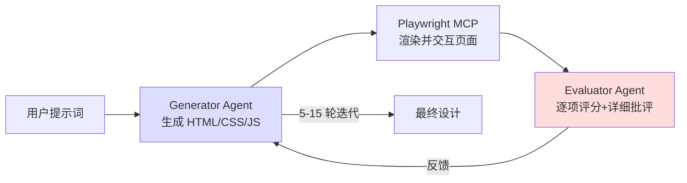
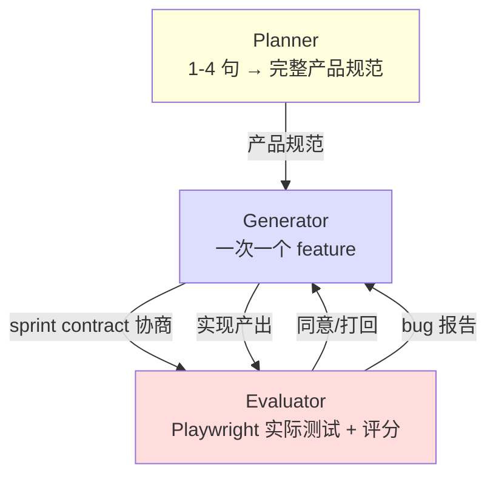

# 生成器-评估器架构（Generator-Evaluator）

> **核心思想**：受 **GAN（生成对抗网络）** 启发，把"做事"和"判断"**结构性地分离**到两个独立智能体，并通过**多轮迭代循环**让生成器在评估器的反馈下持续演化。

这是 [[Doer-Verifier 框架]] 思想在**主观质量任务**（如设计）和**长时复杂任务**（如全栈开发）上的**工程实现**。

---

## 与 Doer-Verifier 的关系

| 维度 | [[Doer-Verifier 框架]] | 生成器-评估器架构 |
|------|---------------------|----------------|
| **来源** | Building Effective Human-Agent Teams | Harness Design 工程博客 |
| **视角** | 团队管理层 | **工程实现层** |
| **核心模式** | 单次验证通过/失败 | **多轮迭代循环** |
| **评估手段** | 列举多种验证手段（测试、rubric 等） | **Playwright MCP 实际交互** + 结构化评分标准 |
| **典型场景** | 团队内的常规工作 | **长时、主观、复杂任务** |
| **可能含 Planner** | 否 | **是**（形成三智能体架构） |

> **本质升级**：Doer-Verifier 是**点对点**关系（Doer → Verifier → 结果），生成器-评估器是**循环迭代**关系（Generator ↔ Evaluator 多次往返）+ 可选的 Planner 前置。

---

## 核心原则

### 1️⃣ 结构性分离做与评

> **关键洞察**：让智能体评估自己的产出时，它倾向于**自信地赞美**——即使质量明显平庸。

- 主观任务尤为严重——没有"测试通过/失败"的二元判断
- 即使客观任务，智能体也常**判断失误**妨碍表现

> **解法**：**把"做事"和"判断"分给不同的智能体**。

仅仅分离**不立即消除**宽容——评估器仍是倾向于慷慨的 LLM。但**调整一个独立评估器变得严格**，远比**让生成器自我批评**更容易。一旦外部反馈存在，生成器就有了**具体可迭代的依据**。

### 2️⃣ 让主观质量可评分

> 美学虽无法完全量化，但可以通过**编码设计原则和偏好**的评分标准来改善。

- "这个设计美吗？" → **难以一致回答**
- "它遵循了我们的设计原则吗？" → **有了具体可评分的依据**

> 通过 **few-shot 示例 + 详细分数拆解**校准评估器——确保判断**与人类偏好对齐**，减少迭代间的分数漂移。

### 3️⃣ 战略决策：精炼 vs 切换方向

每次评估后，生成器需要做**战略决策**：

- **分数趋势良好** → 继续精炼当前方向
- **当前方法不奏效** → **完全切换美学路线**

---

## 评分标准设计模式

> 设计良好的评分标准**本身就**能让模型**远离默认套路**——即使在第一轮、没有评估器反馈的情况下。

### 前端设计的四项标准

| 标准 | 关注点 | 默认表现 | 加权 |
|------|--------|---------|------|
| **Design quality** | 是否为有机整体——色彩、字体、布局、图像共同营造独特氛围 | 较弱 | **高** |
| **Originality** | 是否有自定义决策的痕迹（vs 模板化、库默认） | 较弱 | **高** |
| **Craft** | 技术执行——字体层级、间距、色彩和谐、对比度 | 已较好 | 中 |
| **Functionality** | 美学之外的可用性 | 已较好 | 中 |

> **明确惩罚**典型 AI slop 模式（如紫色渐变覆盖白色卡片）。
> **加权偏向** Design quality 与 Originality → 推动模型冒更大美学风险。

### 全栈开发的扩展标准

借鉴前端实验，扩展为：

- **Product depth**（产品深度）
- **Functionality**（功能性）
- **Visual design**（视觉设计）
- **Code quality**（代码质量）

每项有**硬阈值**，任意一项未达标 → sprint 失败。

---

## 工作循环（前端设计版）



### 关键细节

- **评估器实际导航页面**、截图、仔细研究实现后再产出评估
- **每轮评估推动生成器朝更独特方向演化**
- **完整运行最长 4 小时**
- **迭代间会出现突然的美学转向**——并非总线性渐进

---

## 工作循环（全栈开发版 - 三智能体）



### 三智能体分工

| Agent | 职责 | 关键设计 |
|-------|------|---------|
| **Planner** | 把 1-4 句提示扩展为**完整产品规范** | **强调范围雄心**；**不指定细节**实现，让下游摸索路径 |
| **Generator** | 一次一个 feature（sprint 模式）实现 | 每个 sprint **自评**后再交 QA；git 版本控制 |
| **Evaluator** | Playwright 实际测试 + 评分 | 每项标准**硬阈值**；任意未达标 → 失败 |

---

## 关键机制：Sprint Contract（冲刺合同）

> **每个 sprint 开始前**，生成器和评估器**协商合同**——先就"什么算完成"达成一致，**再写任何代码**。

### 流程

```
1. 生成器提议：本 sprint 我将构建什么、如何验证成功
2. 评估器审查：确保生成器在构建正确的东西
3. 双方迭代直到达成一致
4. 生成器按合同构建
5. 完成后交 QA
```

### 存在原因

> 产品规范**有意保持高层** → 需要一个"用户故事 ↔ 可测试实现"桥梁。

### 通信方式

通过**文件**通信：

- 一个 agent 写文件
- 另一个读并回复（在同一文件或新文件）
- 避免**过早过度具体化**实现

---

## 调优评估器：从"糟糕的 QA"到"能干的 QA"

> **开箱即用**的 Claude 是**糟糕的 QA agent**：
> - 早期会**识别合法问题**但说服自己**不是大问题**而放行
> - 倾向于**表面测试**而非探查边界，遗漏细微 bug

### 调优循环

```
读评估器日志
   ↓
找到判断与人类偏好背离的例子
   ↓
更新 QA 提示词针对那些问题
   ↓
重复
```

### 评估器的优秀表现示例

| 合同条件 | 评估器发现 |
|---------|----------|
| 矩形填充工具应支持 click-drag 填充区域 | **FAIL** — 工具只在拖拽开始/结束点放置 tile，未填充区域。`fillRectangle` 函数存在但 mouseUp 未正确触发 |
| 用户可选中并删除 entity spawn points | **FAIL** — Delete 键处理要求 `selection` 和 `selectedEntityId` 都设置，但点击 entity 只设置 `selectedEntityId`。条件应为 `selection \|\| (selectedEntityId && activeLayer === 'entity')` |
| 用户可通过 API 重新排序动画帧 | **FAIL** — `PUT /frames/reorder` 路由定义在 `/{frame_id}` 路由之后。FastAPI 把 "reorder" 匹配为 frame_id 整数并返回 422 |

> **调到这种水平需要工作**——但**与 Solo 模式相比提升明显**。

---

## 何时需要 Evaluator（成本决策）

> **Evaluator 不是固定的是/否决策**——当任务**超出当前模型可靠 solo 完成的范围**时，它**就值得成本**。

| 模型能力 | 评估器价值 |
|---------|----------|
| **接近"边界"**（如 Opus 4.5） | 评估器捕获**整个构建中有意义的问题** |
| **远超边界**（如 Opus 4.6 后期） | 评估器在**仍处于边界外的任务**上提供 lift，在**边界内**成为不必要开销 |

> **实操**：**不把评估器视为永远必要的组件**——而是**根据当前模型能力评估任务难度**后**动态决定**。

---

## 简化原则：逐一移除组件

> Harness 中的每个组件都编码了"模型做不了什么"的假设——这些假设**值得压力测试**，因为它们**可能错误**，也会**随模型进步而过时**。

### 迭代方法

- **激进简化尝试失败**——**无法复制**原始表现，且难以判断**哪些组件是 load-bearing**
- 转为**更系统化**：**一次移除一个组件**，审视其对最终结果的影响

### 实际移除决策（Opus 4.6 后）

| 组件 | 决策 | 原因 |
|------|------|------|
| **Sprint 分解** | 移除 | Opus 4.6 自身能处理连贯工作 |
| **Planner** | **保留** | 没有它，生成器会**范围过窄** |
| **Evaluator** | **从每 sprint → 单次终末评估** | 价值在任务难度边界附近 |

---

## 适用范围

### ✅ 适合

- **主观质量**任务（设计、美学、写作）
- **长时复杂**任务（多文件、多模块、多小时）
- 需要**外部视角**对抗自评偏差的场景
- 有**可定义评估标准**的工作

### ❌ 不适合

- **简单明确**的任务（用 Workflows 即可——见 [[智能体官方定义]]）
- **模型已远超边界**的任务（评估器成为不必要开销）
- **无明确评估标准**的任务（评估器难以校准）

---

## 与其他模式的关系

| 模式 | 关系 |
|------|------|
| **[[Doer-Verifier 框架]]** | **父概念**——生成器-评估器是其工程实现深化 |
| **[[智能体官方定义\|五大 Workflow 模式]] 中的 Evaluator-Optimizer** | **同源思想**——一个 LLM 生成，另一个评估反馈成循环；本模式是其**长时 + GAN 启发的工程化版本** |
| **[[Lesson 4 信任建立]]** | 本模式是 Lesson 4 "**多重自我验证手段**"中**最重的一种**实现 |

---

## 链接

- **来源工程博客**: [[Harness design for long-running application development]]
- **官方链接**: <https://www.anthropic.com/engineering/harness-design-long-running-apps>
- **作者**: Prithvi Rajasekaran（Anthropic Labs）

## 来源

- [[Harness design for long-running application development]]
- 相关：[[Doer-Verifier 框架]]、[[智能体官方定义]]