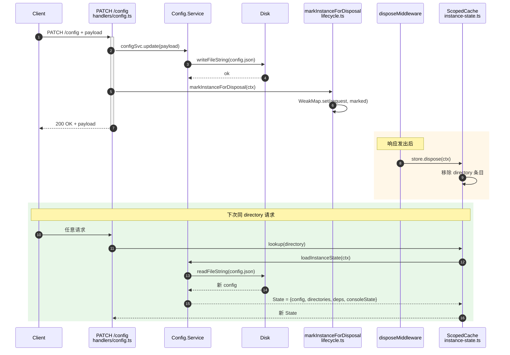

# opencode Config 内存内更新机制研究

> [!question] 研究问题
> opencode 有没有提供 ==**纯内存内**== 更新 config 的方法（运行中热改、订阅变更事件、Service 层 in-place 写入），而不需要重启服务？

## 结论

> [!warning] 核心结论
> opencode 当前**不提供**纯内存内的 config 更新。唯一路径 `PATCH /config` 走"==写盘 + 销毁整个 InstanceState 缓存 + 下次请求从盘重读=="的策略。功能上等价于"为这个 workspace 重启一次"，但**比整个进程重启轻**（只清掉 per-directory 的 `ScopedCache` 条目）。

## 搜索过程

> [!info] 检索信息
> - **工具**：`mcp__idea-mcp__*`（用户明确要求；子代理如派发也要走 idea-mcp）
> - **关键搜索词**：`updateConfig` / `ConfigReloaded` / `configBus` / `markInstanceForDisposal` / `markInstanceForReload` / `instanceState.invalidate`
> - **关键文件定位**：
>   - `packages/opencode/src/server/routes/instance/httpapi/handlers/config.ts`
>   - `packages/opencode/src/server/routes/instance/httpapi/groups/config.ts`
>   - `packages/opencode/src/config/config.ts`
>   - `packages/opencode/src/server/routes/instance/httpapi/lifecycle.ts`
>   - `packages/opencode/src/effect/instance-state.ts`
>   - `packages/opencode/src/server/routes/instance/httpapi/server.ts`
>   - `packages/opencode/test/server/httpapi-config.test.ts`

## 调用链流程



## 调用链详解

### 入口：HTTP PATCH /config

`packages/opencode/src/server/routes/instance/httpapi/handlers/config.ts:18-22` ^handler-config-update

```ts
const update = Effect.fn("ConfigHttpApi.update")(function* (ctx) {
  yield* configSvc.update(ctx.payload)                           // 1. 落盘
  yield* markInstanceForDisposal(yield* InstanceState.context)    // 2. 标记实例销毁
  return ctx.payload
})
```

### 第 1 步：`Config.Service.update` 只写文件 ^svc-update

`packages/opencode/src/config/config.ts:484-492`

```ts
const update = Effect.fn("Config.update")(function* (config: Info) {
  const dir = yield* InstanceState.directory
  const file = path.join(dir, "config.json")
  const existing = yield* loadFile(file)
  yield* fs
    .writeFileString(file, JSON.stringify(mergeDeep(writable(existing), writable(config)), null, 2))
    .pipe(Effect.orDie)
})
```

特性：
- 写 `<workspace>/config.json`，**不**触碰内存中的 `InstanceState` 缓存
- 用 `mergeDeep` 而不是替换，保留文件里未在 payload 中的字段

> [!note] `updateGlobal` 的差异
> `config.ts:494-512` 写完文件后调 `invalidate()` 让 **global 配置 cache** 失效（用 `Effect.cachedInvalidateWithTTL`），但**实例级** config 缓存依然存在。

### 第 2 步：`markInstanceForDisposal` 只做标记 ^mark-disposal

`packages/opencode/src/server/routes/instance/httpapi/lifecycle.ts:26-37`

```ts
export const markInstanceForDisposal = (ctx: InstanceContext) =>
  Effect.gen(function* () {
    const marked = yield* mark(ctx)
    return yield* HttpEffect.appendPreResponseHandler((request, response) =>
      Effect.sync(() => {
        disposeAfterResponse.set(request.source, marked)  // 仅登记
        return response
      }),
    )
  })
```

> [!tip] 关键设计
> **请求/响应阶段不销毁**，只把"待销毁"标记塞进 `WeakMap<request, marked>`。等响应发出后由 `disposeMiddleware` 统一执行。

### 第 3 步：`disposeMiddleware` 在响应发出后真销毁 ^dispose-middleware

`lifecycle.ts:50-59`

```ts
export const disposeMiddleware: HttpMiddleware.HttpMiddleware = (effect) =>
  Effect.gen(function* () {
    const response = yield* effect
    const request = yield* HttpServerRequest.HttpServerRequest
    const marked = disposeAfterResponse.get(request.source)
    if (!marked) return response
    disposeAfterResponse.delete(request.source)
    yield* Effect.uninterruptible(
      marked.bridge.run(marked.store.dispose(marked.ctx))  // 真销毁
    ).pipe(Effect.catchCause((cause) =>
      Effect.sync(() => log.warn("instance disposal failed", { cause })),
    ))
    return response
  })
```

`disposeMiddleware` 挂在 `webHandler` 上（[[../../../wiki/opencode/实践/opencode Config 内存内更新机制研究#^server-ts-182|server.ts:182]] 路径说明），对所有请求生效。`store.dispose(ctx)` 走 `InstanceState` 的 `ScopedCache`：

`packages/opencode/src/effect/instance-state.ts:38-56` ^instance-state-cache

```ts
const cache = yield* ScopedCache.make<string, A, E, R>({
  capacity: Number.POSITIVE_INFINITY,
  lookup: () => Effect.gen(function* () {
    return yield* init(yield* context)  // loadInstanceState，从盘读
  }),
})
```

dispose 把这个 directory 的 `State = { config, directories, deps, consoleState }` **整块**移除。

### 第 4 步：下次请求触发 lookup

下一次同 directory 的 HTTP 请求 → cache miss → `lookup` → `loadInstanceState` → 从磁盘读新 config.json + 重建 `State`。

测试印证：`packages/opencode/test/server/httpapi-config.test.ts:20-23` ^test-disposed-event 显式等待全局事件 `server.instance.disposed`：

```ts
function waitDisposed(directory: string) {
  return waitGlobalBusEvent({
    message: "timed out waiting for instance disposal",
    predicate: (event) =>
      event.payload.type === "server.instance.disposed" && event.directory === directory,
  })
}
```

## 软重载模式存在，但 config update 没用

> [!example] `markInstanceForReload`
> `lifecycle.ts:38-46` 提供了 `markInstanceForReload(ctx, next)`，走 `store.reload(next)` —— 传入新的 `LoadInput`，**不彻底销毁**。
>
> 它被 `project.initGit` 使用（`handlers/project.ts:27-34`）—— 当 worktree / vcs 变化时，把新的 `Project` 实体灌进实例。
>
> **config update 端点没接这条路**，原因推测[^why-dispose]：
> - config 改动会联动 `agent / mode / plugin / permissions` 等很多派生字段
> - 整体重建比选择性 patch 简单，出错面小
> - `deps`（后台 npm install fiber）反正要重做

[^why-dispose]: 这些是阅读代码后的推测，未和 opencode 维护者确认

## 想要"真内存内"的实现路径

> [!success] 路径 A：改 `Config.update` 直接写 `InstanceState` 缓存
>
> 在 `config.ts:484` 那里只写文件，加一个 `Ref<State>` 引用然后 `Ref.set` 即可。需要：
> - `InstanceState.make` 把 `cache` 暴露成 `Ref<State>` 而非 `ScopedCache`
> - `Config.update` 改 `Ref` 而非 `fs.writeFileString`
> - 删掉 `markInstanceForDisposal` 调用
>
> **收益**：免一次 dispose+重建。**风险**：要确保所有派生消费方（`Config.get` / `Config.getConsoleState` 等）从同一个 `Ref` 读。

> [!success] 路径 B：复用 `markInstanceForReload`
>
> `lifecycle.ts:38` 已支持传 `LoadInput`。只要：
> - 把 config update 改成"读新 file + reload(loadInput)"而非 dispose
> - `LoadInput` 把新 config 注入
>
> **收益**：避免 `deps / consoleState` 等不必要重建。**风险**：`plugin_origins` 之类的派生状态需要手工 reset。

## 关键代码位置速查

| 关注点 | 路径 | 行 | 块 ID |
|---|---|---|---|
| HTTP handler（PATCH /config） | `packages/opencode/src/server/routes/instance/httpapi/handlers/config.ts` | 18-22 | ^handler-config-update |
| `Config.Service` 定义 | `packages/opencode/src/config/config.ts` | 96-104 | |
| `Interface` 声明（所有方法） | `packages/opencode/src/config/config.ts` | 89-95 | |
| `update` 实现（写盘 only） | `packages/opencode/src/config/config.ts` | 484-492 | ^svc-update |
| `updateGlobal` 实现（写盘 + 失效 global cache） | `packages/opencode/src/config/config.ts` | 494-512 | |
| `markInstanceForDisposal` 标记 | `packages/opencode/src/server/routes/instance/httpapi/lifecycle.ts` | 26-37 | ^mark-disposal |
| `markInstanceForReload` 软重载 | `packages/opencode/src/server/routes/instance/httpapi/lifecycle.ts` | 38-46 | |
| `disposeMiddleware` 真销毁 | `packages/opencode/src/server/routes/instance/httpapi/lifecycle.ts` | 50-59 | ^dispose-middleware |
| `InstanceState` ScopedCache | `packages/opencode/src/effect/instance-state.ts` | 38-56 | ^instance-state-cache |
| 全局挂载 disposeMiddleware | `packages/opencode/src/server/routes/instance/httpapi/server.ts` | 182 | |
| 测试断言 disposal 事件 | `packages/opencode/test/server/httpapi-config.test.ts` | 20-23 | ^test-disposed-event |

## 验证结果

| 验证项 | 结果 |
|---|---|
| idea-mcp 工具检索完整调用链 | ✅ |
| `ConfigReloaded` / `configBus` 类事件搜索 | ✅ 无结果（确认无事件总线机制） |
| `markInstanceForDisposal` 全仓使用点 | ✅ config.ts + instance.ts 两处 |
| 测试断言 disposal 事件存在 | ✅ `httpapi-config.test.ts:20-23` |

## 相关文档

- [[实施记录 - 桌面端 /skills 弹窗]] - 同目录下的实施记录，参考其 frontmatter / 决策表格格式
- [[../架构/桌面端 vs TUI 架构对比]] - 架构差异参考
- `packages/opencode/src/config/config.ts` - Service 完整实现
- `packages/opencode/src/effect/instance-state.ts` - 缓存层
- `packages/opencode/src/server/routes/instance/httpapi/lifecycle.ts` - 销毁/重载生命周期
