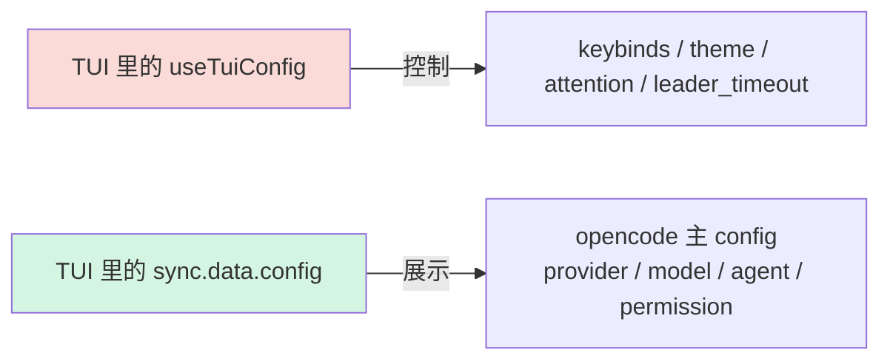

# opencode TUI 与 Config/InstanceState 生命周期集成知识

> [!abstract] 范围
> 整理 opencode TUI 客户端与 server 端 `InstanceState` / `Config` 生命周期的衔接机制，以及 TUI 内部的命令、dialog、状态同步模式。所有结论基于 [[opencode Config 内存内更新机制研究]] 的 server 端分析。

## 核心架构图

```mermaid
graph TB
    subgraph Server
        SVC[Config.Service]
        STATE[InstanceState<br/>ScopedCache&lt;directory&gt;]
        BUS[Global Bus]
    end
    
    subgraph TUI
        SYNC[Sync Context<br/>sync.tsx]
        STORE[Solid Store]
        STORE2[SDK Client]
    end
    
    STATE -.instance.disposed.-> BUS
    BUS -->|SSE| SYNC
    SYNC -->|bootstrap()| STORE2
    STORE2 -->|HTTP GET| SVC
    STORE2 -->|reconcile| STORE
    
    style BUS fill:#f9e79f
    style SYNC fill:#aed6f1
```

## 知识点 1：TUI 通过事件订阅自动重同步

> [!info] 关键代码
> `packages/opencode/src/cli/cmd/tui/context/sync.tsx:142-144`
> ```ts
> event.subscribe((event, { workspace }) => {
>   switch (event.type) {
>     case "server.instance.disposed":
>       void bootstrap()
>       break
> ```
> 收到 `server.instance.disposed` **SSE 事件**时，TUI **不会**卸载 UI，**不会**退出进程，而是调用 `bootstrap()` 重新拉取所有数据并 `reconcile` 到 Solid store。

`bootstrap()` 拉取的接口（同一份代码，onMount 也用它）：
| 接口 | 用途 |
|---|---|
| `config.get` | 当前生效 config |
| `config.providers` | provider 列表 + 默认 model |
| `provider.list` | 详细 provider 元数据 |
| `app.agents` | agent 列表 |
| `command.list` | slash command 列表 |
| `lsp.status` | LSP server 状态 |
| `mcp.status` | MCP server 状态 |
| `formatter.status` | formatter 状态 |
| `session.list` / `session.status` | session 列表（启动时不阻塞） |
| `vcs.get` | git 分支信息 |
| `experimental.console.get` | 控制台账号状态 |

## 知识点 2：TUI 没有 `config.update` 入口

| 调用方 | `config.update` | `config.get` | `config.providers` |
|---|---|---|---|
| **`packages/app`**（web） | ✅ 多处（settings 页面） | ✅ | ✅ |
| **`packages/desktop`**（native） | ✅ | ✅ | ✅ |
| **`packages/opencode/src/cli/cmd/tui`** | ❌ **0 调用** | ✅ bootstrap | ✅ bootstrap |

> [!warning] 设计哲学
> TUI 用户的 config 改法：**退出 TUI → 手编 `~/.config/opencode/opencode.jsonc` → 重启 TUI**。
> TUI 是 CLI 哲学的纯键盘界面，加表单型 settings 与产品定位冲突。

## 知识点 3：TUI 里的"Config"有两个不同概念



| 维度 | `useTuiConfig` (TUI 内部) | `sync.data.config` (opencode 主) |
|---|---|---|
| 定义位置 | `packages/opencode/src/cli/cmd/tui/context/tui-config.tsx` | `sync.tsx` 内 Solid store 字段 |
| 数据源 | `tui.json`（独立文件） | `opencode.jsonc` |
| Service 实现 | `packages/opencode/src/cli/cmd/tui/config/tui.ts` 的 `TuiConfig.Service` | `packages/opencode/src/config/config.ts` 的 `Config.Service` |
| 接口 | 只有 `get` + `waitForDependencies`，**只读** | `get` / `update` / `updateGlobal` / `invalidate` |
| 加载时机 | TUI 启动时 `loadState` 一次性 | 每次 `bootstrap()` 拉一次 |

## 知识点 4：TUI 命令注册机制

> [!example] 现代 API（取代已废弃的 `api.command.register`）
> `packages/opencode/src/cli/cmd/tui/feature-plugins/system/which-key.tsx` 给出了完整模板：
> ```ts
> api.keymap.registerLayer({
>   priority: LAYER_PRIORITY,  // 数字越大越优先
>   commands: [
>     {
>       name: "which-key.toggle",
>       title: "Show key bindings",
>       desc: "Toggle which-key overlay",
>       category: "System",
>       run() { /* 触发逻辑 */ },
>     },
>   ],
>   bindings: api.tuiConfig.keybinds.gather("group-name", [command.toggle]),
> })
> ```
> 关键字段：
> - `name`：命令 ID（全局唯一）
> - `title` / `desc`：命令面板显示
> - `category`：分类
> - `slashName`：注册为 `/<slashName>` 斜杠命令（可选）
> - `run()`：执行函数
> - `bindings`：可选快捷键

> [!example] Legacy API（v1 插件还在用，v2 删除）
> `packages/opencode/src/cli/cmd/tui/plugin/command-shim.ts:93` 已发废弃警告：
> ```ts
> warnOnce("api.command.register", 
>          "api.keymap.registerLayer({ commands, bindings })", 
>          warnCommandShim)
> ```

## 知识点 5：Dialog 模式

`packages/opencode/src/cli/cmd/tui/ui/dialog.tsx` 定义了栈式 dialog 系统：

```ts
const dialog = useDialog()
dialog.replace(() => <MyDialog />)  // 替换栈顶（先关旧的）
dialog.setSize("xlarge")             // 调尺寸
dialog.clear()                       // 清空栈
```

| size | width |
|---|---|
| `"medium"` (默认) | 60 |
| `"large"` | 88 |
| `"xlarge"` | 116 |

内置 Dialog 组件：
- `DialogAlert.show(dialog, title, message)` — 简单确认
- `DialogConfirm` — yes/no
- `DialogPrompt` — 文本输入
- `DialogSelect` — 列表选择
- `DialogHelp` — 帮助文档
- `DialogExportOptions` — 导出选项

新建 dialog 的模板：

```tsx
import { Dialog, useDialog } from "./dialog"
import { useTheme } from "../context/theme"

export function DialogMyFeature(props: { ... }) {
  const dialog = useDialog()
  const { theme } = useTheme()
  
  useBindings(() => ({
    bindings: [
      { key: "escape", desc: "Close", group: "Dialog", cmd: () => dialog.clear() },
      { key: "return", desc: "Confirm", group: "Dialog", cmd: () => { /* ... */ dialog.clear() } },
    ],
  }))
  
  return (
    <Dialog size="large" onClose={() => dialog.clear()}>
      <box paddingLeft={2} paddingRight={2} gap={1}>
        {/* 内容 */}
      </box>
    </Dialog>
  )
}

DialogMyFeature.show = (dialog, props) => new Promise((resolve) => {
  dialog.replace(() => <DialogMyFeature {...props} onConfirm={resolve} onClose={() => resolve(undefined)} />)
})
```

## 知识点 6：`markInstanceForDisposal` vs `markInstanceForReload`

`packages/opencode/src/server/routes/instance/httpapi/lifecycle.ts` 提供两个工具：

| 工具 | 行 | 行为 | 适用场景 |
|---|---|---|---|
| `markInstanceForDisposal(ctx)` | 26-37 | 响应后销毁整个 `ScopedCache` 条目，下次 lookup 重新走 `loadInstanceState` | **config 完全重置**（provider 列表大改、agent 体系换） |
| `markInstanceForReload(ctx, next)` | 38-46 | 响应后调 `store.reload(next)`，传入新的 `LoadInput` | **project 上下文变化**（worktree 切换、git init） |
| `disposeMiddleware` | 50-59 | 实际执行上述登记动作的全局中间件 | — |

`markInstanceForReload` 走的是 `InstanceStore.reload`，**不**走 `ScopedCache.invalidate` + 重新 `init`，开销小；`markInstanceForDisposal` 更彻底，重建所有派生状态。

> [!note] 关键判断
> 选择 reload vs disposal 的依据：**改动是否影响所有派生状态**？
> - 改 project 上下文（worktree、vcs）→ reload
> - 改 config（provider、agent、plugin）→ disposal
> - 理由：config 改动会让 `agent` / `mode` / `plugin_origins` / `consoleState` 全部失效，整体重建比选择性 patch 简单

## 知识点 7：Skill 数据结构

`packages/opencode/src/skill/index.ts:38`：
```ts
export const Info = Schema.Struct({
  name: Schema.String,        // 唯一 key
  description: Schema.optional(Schema.String),
  location: Schema.String,   // 磁盘路径
  content: Schema.String,     // SKILL.md 正文
})
```

| 维度 | 值 |
|---|---|
| 存储 | `Record<name, Info>`，在 `InstanceState` 内（按 directory 缓存） |
| diff key | `name` |
| 触发重载 | `InstanceState.make<State>` 的 init 函数 → 调 `loadSkills` |
| 内置 skill | `customize-opencode`（`name: "customize-opencode"`），用 `<built-in>` 作为 location |

> [!example] 加载流程（`skill/index.ts`）
> 1. `discoverSkills` — 扫多个目录（外部 `.claude` / `.agents`、项目 `.opencode`、config.skills.paths、config.skills.urls）
> 2. `loadSkills` — 对每个匹配文件 `ConfigMarkdown.parse` + 校验 frontmatter
> 3. 重复 name 取**最后加载**的，warn 一条日志

## 知识点 8：MCP 数据结构

`packages/opencode/src/mcp/index.ts:94` 定义 `Status`：
```ts
export const Status = Schema.Union([
  StatusConnected,              // { status: "connected" }
  StatusDisabled,               // { status: "disabled" }
  StatusFailed,                 // { status: "failed", error: string }
  StatusNeedsAuth,              // { status: "needs_auth" }
  StatusNeedsClientRegistration // { status: "needs_client_registration", error }
])
```

`packages/opencode/src/server/routes/instance/httpapi/groups/mcp.ts:16`：
```ts
export const StatusMap = Schema.Record(Schema.String, MCP.Status)
// → Record<serverName, Status>
```

| 维度 | 值 |
|---|---|
| 存储 | `Record<name, Status>`，从 `cfg.mcp` 派生（不是独立 config 字段） |
| diff key | server name（`cfg.mcp` 的 key） |
| 触发重载 | `MCP.state` 的 `InstanceState.make` → 重新连接所有 server |
| 副作用 | 杀掉旧 client 进程（`SIGTERM` + descendant `pgrep`） |

> [!warning] MCP 状态易变
> MCP 的 `defs`（实际工具列表）会**动态**变化（通过 `ToolListChangedNotificationSchema` 通知），**不**算 config diff。Reload 后 SDK 拉到的 `mcp.status` 自然反映新值。

## 知识点 9：InstanceState 清理机制

`packages/opencode/src/effect/instance-state.ts:38-56` 的 `make` 注册了 disposer：

```ts
const off = registerDisposer((directory) =>
  Effect.runPromise(ScopedCache.invalidate(cache, directory)
    .pipe(Effect.provide(EffectLogger.layer)))
)
yield* Effect.addFinalizer(() => Effect.sync(off))
```

`registerDisposer` 在 `packages/opencode/src/effect/instance-registry.ts`，由 `InstanceStore.dispose(ctx)` 集中调用。

> [!example] dispose 链路
> 1. `markInstanceForDisposal` 把 marked 塞进 `WeakMap<request, marked>`
> 2. `disposeMiddleware` 在响应发出后从 WeakMap 拿出 marked，调 `store.dispose(ctx)`
> 3. `InstanceStore` 遍历所有 `InstanceState` 的 `disposer`，每个按 directory 调 `ScopedCache.invalidate`
> 4. emit `server.instance.disposed` 事件
> 5. TUI 收到 → `bootstrap()` → 重建

## 知识点 10：典型"软重载" 模式对照

| 模式 | 代码 | 触发 |
|---|---|---|
| **改 config** | `markInstanceForDisposal` | `PATCH /config` |
| **改 project** | `markInstanceForReload(next)` | `POST /project/init-git` |
| **关实例（手动）** | `markInstanceForDisposal` | `POST /instance/dispose` |
| **client 不存在** | `markInstanceForReload` | `Stream.takeUntil(... instance.disposed)` 触发 |

## 知识点 11：TUI plugin install 机制

> [!info] 核心定位
> TUI 的 "install plugin" 走的是 **进程内函数调用**（`api.plugins.install(spec, { global })`），**不**走 HTTP SDK，是 reload 命令的现成模板。

### 4 个核心代码路径

| 角色 | 文件 | 行 |
|---|---|---|
| 命令注册 | `packages/opencode/src/cli/cmd/tui/feature-plugins/system/plugins.tsx` | 239（`api.keymap.registerLayer`） |
| 默认 keybind | `packages/opencode/src/cli/cmd/tui/config/keybind.ts` | 220（`plugin_manager: keybind("none", ...)`） |
| 安装对话框 | 同上 `plugins.tsx` | `Install` 组件（`DialogPrompt` + `placeholder="npm package name"`） |
| 实际安装入口 | `packages/opencode/src/cli/cmd/tui/plugin/runtime.ts` | 1055（`installPlugin(spec, { global })`） |
| server 侧实现 | `packages/opencode/src/plugin/install.ts` | 259（被 runtime 调用） |

### 核心逻辑链

```mermaid
graph LR
    A[api.keymap.registerLayer<br/>name: plugin_manager] -->|user trigger| B[Install 对话框<br/>DialogPrompt]
    B -->|spec + global| C[api.plugins.install]
    C -->|进程内| D[runtime.ts:1055 installPlugin]
    D --> E[plugin/install.ts:259]
    E -->|写 opencode.jsonc| F[server 端 markInstanceForDisposal]
    F -->|SSE server.instance.disposed| G[TUI sync.tsx bootstrap]

    style C fill:#f9e79f
    style G fill:#aed6f1
```



### 关键代码片段

`feature-plugins/system/plugins.tsx:239`
```ts
api.keymap.registerLayer({
  commands: [
    { name: "plugin_manager", title: "Open plugin manager", ... },
    { name: "plugins.list", ... },
  ],
  bindings: api.tuiConfig.keybinds.gather("system", [...]),
})
```

`config/keybind.ts:220`
```ts
plugin_manager: keybind("none", "Open plugin manager dialog"),
```

`feature-plugins/system/plugins.tsx`（`Install` 组件）
```ts
title="Install plugin"
placeholder="npm package name"
// tab 键切换 global/local scope
void props.api.plugins.install(mod, { global: global() })
```

`plugin/runtime.ts:1055`
```ts
export async function installPlugin(spec: string, options?: { global?: boolean })
// 内部走 installPluginBySpec → installModulePlugin (plugin/install.ts)
```

### 关键洞察：天然 reload 链路

> [!example] install 完成后,server 端会主动触发 reload
> 1. `plugin/install.ts` 把 spec 写入 `opencode.jsonc`（`mcp`/`plugin` 段）
> 2. server 端 `markInstanceForDisposal` 让 instance 失效
> 3. emit `server.instance.disposed` SSE
> 4. TUI `sync.tsx:142-144` 收到事件 → `void bootstrap()`
> 5. `bootstrap()` 重新拉 `config.get` / `config.providers` / `provider.list` / `app.agents` / `command.list` / `lsp.status` / `mcp.status` / `formatter.status` / `session.*` / `vcs.get`

**结论**：手动 reload 命令 = **复用 `bootstrap()`** 即可，server 端不用动。最小新文件 `feature-plugins/system/reload.tsx`（一行 `run() { bootstrap() }`）+ `config/keybind.ts` 加 `reload_config: keybind("<leader>r", ...)`。

### 不存在的概念

- ❌ `client.plugin.install` HTTP 端点（TUI 不走 SDK 调）
- ❌ "marketplace" UI（搜遍 TUI 目录无命中，仅 `docs/development.mdx` 和 `node_modules/stripe/types/` 有该字面量）
- ❌ `DialogPlugin` 独立文件（dialog 逻辑全部内联在 `plugins.tsx` 的 `Install` 组件里）

## 知识点 12：SSE 事件全清单

> [!info] 范围
> opencode server 端通过 SSE 推送给 TUI/Web 客户端的全部事件类型。共 **86 个**:4 个 transport + 82 个业务。Schema 统一定义在 `core/src/event.ts:1-80` 的 `EventV2.define()` + `Payload<T>`。

### 核心定义位置

| 角色 | 文件:行 |
|---|---|
| EventV2 schema 注册器 | `packages/core/src/event.ts:1-80` |
| Server 端 schema | `packages/opencode/src/server/event.ts:4-9` |
| Global SSE 转发点 | `packages/opencode/src/server/routes/instance/httpapi/handlers/global.ts:47-56` |
| Instance SSE 转发点 | `packages/opencode/src/server/routes/instance/httpapi/handlers/event.ts:68-78` |
| V2 SDK 类型镜像(自动生成) | `packages/sdk/js/src/v2/gen/types.gen.ts:8-95` |
| V1 SDK 镜像(legacy) | `packages/sdk/js/src/gen/types.gen.ts` |

### 4 个 Transport 事件(SSE 协议级)

| 事件 | 含义 | 触发 |
|---|---|---|
| `server.connected` | 建连 ack | SSE 端点建立后立即发 |
| `server.heartbeat` | 10s keepalive | 周期发 |
| `server.instance.disposed` | instance 销毁 | `instance-store.ts:84` emitDisposed |
| `global.disposed` | server 关闭 | `global-lifecycle.ts` disposeAllInstancesAndEmitGlobalDisposed |

### 82 个业务事件（按主题分组）

**Session 生命周期**
- `session.created` / `session.updated` / `session.deleted`
- `session.status` / `session.idle` / `session.compacted` / `session.error` / `session.diff`

**Session 运行时（细粒度流式）**
- `session.next.agent.switched` / `session.next.model.switched` / `session.next.moved`
- `session.next.prompted` / `session.next.prompt.admitted` / `session.next.prompt.promoted`
- `session.next.synthetic` / `session.next.shell.started` / `session.next.shell.ended`
- `session.next.step.started` / `session.next.step.ended` / `session.next.step.failed`
- `session.next.text.started` / `session.next.text.delta` / `session.next.text.ended`
- `session.next.reasoning.started` / `session.next.reasoning.delta` / `session.next.reasoning.ended`
- `session.next.tool.input.started` / `session.next.tool.input.delta` / `session.next.tool.input.ended`
- `session.next.tool.called` / `session.next.tool.progress` / `session.next.tool.success` / `session.next.tool.failed` / `session.next.retried`
- `session.next.compaction.started` / `session.next.compaction.delta` / `session.next.compaction.ended`

**Message（消息 / 消息块）**
- `message.updated` / `message.removed`
- `message.part.updated` / `message.part.removed` / `message.part.delta`

**File / FS**
- `file.edited`（`filesystem.ts:147`）
- `file.watcher.updated`

**PTY（终端）**
- `pty.created` / `pty.updated` / `pty.exited` / `pty.deleted`

**MCP / LSP / 权限 / 问询**
- `mcp.tools.changed` / `mcp.browser.open.failed`
- `lsp.updated`
- `permission.asked` / `permission.replied`（v1）
- `permission.v2.asked` / `permission.v2.replied`（v2）
- `question.asked` / `question.replied` / `question.rejected`（v1）
- `question.v2.asked` / `question.v2.replied` / `question.v2.rejected`（v2）

**TUI 自身（server → TUI 注入）**
- `tui.prompt.append` / `tui.command.execute` / `tui.toast.show` / `tui.session.select`

**账号 / 凭据 / 安装**
- `account.added` / `account.removed` / `account.switched`
- `installation.updated` / `installation.update_available`

**项目 / 工作区 / VCS / Worktree**
- `project.updated` / `project.directories.updated`
- `workspace.ready` / `workspace.failed` / `workspace.status`
- `vcs.branch.updated`
- `worktree.ready` / `worktree.failed`

**杂项**
- `todo.updated`
- `command.executed`
- `plugin.added`
- `catalog.model.updated`
- `models.dev.refreshed`

### Envelope 格式

- **Global stream**：`{ payload: { id, type, properties } }`
- **Instance stream**：`{ id, type, properties }`（被 `instance.directory` 过滤后转发）
- **共享字段**：`id: string` / `type: string` / `properties: object`

### 关键代码路径

`packages/opencode/src/server/routes/instance/httpapi/handlers/event.ts:50-78`（SSE 端点）
```ts
const disposed = Stream.callback<...>((queue) => {
  const listener = (event) => {
    if (event.directory !== instance.directory || event.payload.type !== "server.instance.disposed") return
    Queue.offerUnsafe(queue, { id: ..., type: "server.instance.disposed", properties: ... })
  }
  return Effect.acquireRelease(
    Effect.sync(() => GlobalBus.on("event", listener)),
    () => Effect.sync(() => GlobalBus.off("event", listener)),
  )
})
const output = stream.pipe(
  Stream.merge(disposed, { haltStrategy: "left" }),
  Stream.takeUntil((event) => event.type === "server.instance.disposed"),
)
```

`packages/opencode/src/cli/cmd/tui/context/sync.tsx:142-144`（TUI 消费）
```ts
event.subscribe((event, { workspace }) => {
  switch (event.type) {
    case "server.instance.disposed":
      void bootstrap()
      break
```

### 设计要点

> [!example] 过滤维度
> - Global stream（`/global/event`）不过滤，所有 workspace 实例都能收到 `server.connected` / `server.heartbeat` / `global.disposed`
> - Instance stream（`/event`）按 `event.directory === instance.directory` 过滤，workspace 隔离
> - Instance stream 收到 `server.instance.disposed` 后 `Stream.takeUntil` 终止，前端需重连

> [!warning] 业务事件发布模式
> 所有 `EventV2` 业务事件通过 `EventV2.publish(...)` 发出 → `GlobalBus.emit("event", ...)` → SSE 端点 `GlobalBus.on("event", listener)` 转发。所有业务事件都从 `EventV2` 单一源派生，V2 SDK 自动生成类型镜像。
## 相关文档

- [[opencode Config 内存内更新机制研究]] — server 端 config 更新机制详解
- `packages/opencode/src/config/config.ts` — `Config.Service` 完整实现
- `packages/opencode/src/effect/instance-state.ts` — ScopedCache 包装层
- `packages/opencode/src/server/routes/instance/httpapi/lifecycle.ts` — disposal/reload 生命周期
- `packages/opencode/src/server/routes/instance/httpapi/handlers/event.ts:50-64` — `server.instance.disposed` 事件过滤
- `packages/opencode/src/cli/cmd/tui/context/sync.tsx` — TUI 同步层
- `packages/opencode/src/cli/cmd/tui/ui/dialog.tsx` — Dialog 栈系统
- `packages/opencode/src/cli/cmd/tui/feature-plugins/` — 内部 TUI 插件目录
